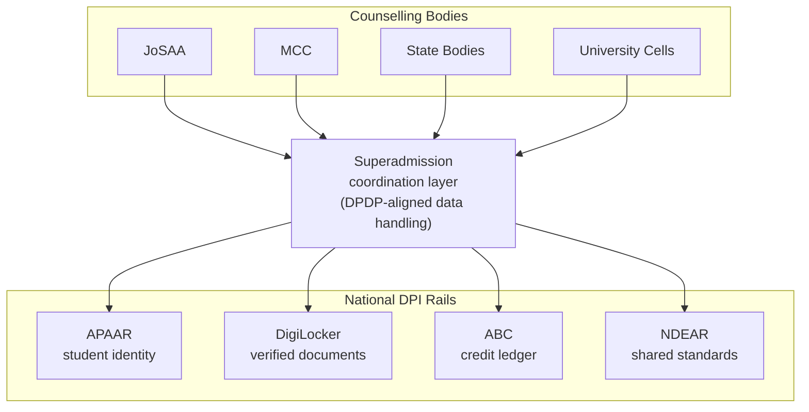

> When a student enters the admission process, creates profile or upload documents , no step happens in isolation. Behind it sits an entire policy and a set of national digital systems built over the last few years, some of which decide what counselling bodies are even allowed to ask for, and others which decide how student's data is allowed to move once they hand it over.

## NEP 2020: The foundation for everything else

Before any of the digital systems described on this page existed, there was a policy decision. In 2020, the Indian government replaced its old education policy with a new one, the National Education Policy, or NEP 2020.

Two parts of NEP matter most for understanding Superadmission:

- **Multiple entry and exit points.** Under the old system, if a student left a degree halfway, that time and effort was mostly wasted, there was no formal way to walk away with partial credit. NEP asked for a system where a student could exit after one year with a certificate, after two with a diploma, and after three or four with a full degree, and later resume from wherever they left off.
- **A single national target.** NEP set a target for the Gross Enrolment Ratio, the share of eligible-age students actually enrolled in higher education, at 50 percent by 2035. As of now, that number sits at roughly 28.4 percent, meaning the systems handling admission and enrolment have real growth to absorb.

Neither of these two things works without some way to track a student's credits and identity across institutions over time. That requirement has shaped everything else mentioned below.

## What "Digital Public Infrastructure" Actually Means

Two things most people have already used without thinking of them this way: paying someone through UPI, and proving your identity with an Aadhaar number. Both are examples of something called Digital Public Infrastructure (DPI).

What makes something DPI, instead of just another app, comes down to three things:

- **Shared system:** <Tooltip tip="UPI (Unified Payments Interface) is a system that lets you transfer money instantly between bank accounts using just your mobile phone.">UPI</Tooltip> isn't a product made by one bank. Every bank, and every payment app, builds on top of the same shared system.
- **It's a set of rules:** DPI defines how systems are allowed to talk to each other, what format data moves in, what gets verified and how. Anyone who follows those rules can build something on top of it.
- Built for everyone: The goal is universal access, a farmer and a bank both use the same UPI rails, not two different systems built for two different budgets.

To make NEP's promise of portable credits and portable identity actually work, India needed the same kind of shared infrastructure, but for education. That's what the next four systems are.

## The Four Building Blocks

### APAAR: One ID for a Student's Entire Academic Life

APAAR stands for Automated Permanent Academic Account Registry. Think of it as an ID number, similar in spirit to Aadhaar, but built specifically to follow a student's academic record.

Right now, A student lets say Unnati has a JEE application number, a separate NEET number if she'd taken that exam too, a school registration number, and she'll get yet another student ID once she joins a college. APAAR is meant to replace this pile of disconnected numbers with one ID that stays with a student from school through every degree they ever pursue.

### ABC: A Bank Account for Academic Credits

ABC stands for Academic Bank of Credits. It works exactly like its name suggests, except what gets deposited isn't money, it's course credits. This is the direct technical answer to NEP's multiple entry and exit promise.

If Unnati studies for a semester at one college and later needs to shift to a different one, or takes a certificate course alongside her degree, ABC is meant to store the credits she earned along the way in one place, tied to her APAAR ID. Credit earned at one institution doesn't just vanish the moment she's no longer enrolled there. She can carry it forward, and in principle even redeem it toward a future degree elsewhere.

### NDEAR: The Core Rules

NDEAR stands for National Digital Education Architecture. It isn't a product a student ever directly touches. It's the underlying set of standards that APAAR, ABC, DigiLocker, and other education systems all agree to follow, so they can exchange information with each other without every single pair of systems needing a custom-built connection between them.

> A useful way to think about it: NDEAR is the agreed shape of the pipes. APAAR, ABC, and DigiLocker are what flows through those pipes.

### DigiLocker: Where Verified Documents Already Live

DigiLocker is a digital storage system where official documents, board marksheets, certificates, sometimes Aadhaar itself, are placed directly by the organisation that issued them, digitally signed, and available for the students to share whenever they're asked for.

## DPDP: Digital Personal Data Protection Act, 2023

DPDP sets out a few plain obligations for anyone handling personal data, including Unnati's rank, category, documents, and contact details as they move through counselling:

- **Consent is required**, and has to be specific, not buried in fine print she never reads.
- **Data can only be used for the purpose it was collected for.** A counselling body collecting her category for seat allocation cannot repurpose it for something unrelated without asking again.
- **She has a right to correction and erasure.** If something about her stored data is wrong, or she wants it removed once it's no longer needed, the law gives her a route to ask for that.

Any system proposing to move a student's data between counselling bodies, DigiLocker, and APAAR, the way Superadmission proposes to, has to be built around these obligations.

## The IndiaAI Mission:

The IndiaAI Mission is the government's national program for building out India's AI capability, compute infrastructure, shared datasets, skilling, and a specific focus area called Safe and Trusted AI, which is about making sure AI systems used in important decisions are explainable and don't behave like an unaccountable <Tooltip tip="Add tooltip text">black box</Tooltip>.

This applies directly to PraveshAI, the reasoning and guidance engine inside Superadmission. A seat allocation decision affects a student's entire future, so using an unexplainable "black box" AI is a major problem. PraveshAI is built so its logic can be inspected and reasoned, matching exactly what the "Safe and Trusted AI" pillar of the IndiaAI Mission asks for.

## Where Superadmission Fits

None of the systems above run counselling or match students to seats. Not one of them decides who gets which seat, that job still belongs to JoSAA, MCC, state counselling bodies, and university admission cells.

Superadmission's proposed position is to sit as a coordination layer above these rails, so that every counselling body doesn't have to independently build its own connection to APAAR, its own connection to DigiLocker, its own DPDP-compliant data handling, and its own connection to ABC.



Superadmission manages this entire process for the student, feeding their data to multiple counseling bodies at the same time. Instead of making students re-upload documents or create new accounts, Superadmission uses APAAR as the core student ID and pulls verified records straight from DigiLocker. It follows NDEAR standards so any counseling body can connect instantly, protects everything under strict DPDP consent rules.

## What This Could Look Like Technically

This is illustrative, meant to show the shape of the idea. A unified student record built this way might look something like this:

```json
{
  "student": {
    "apaarId": "1234-5678-9012-3456",
    "name": "Unnati Sharma",
    "category": "General",
    "consent": {
      "grantedFor": ["seat_allocation", "document_verification"],
      "grantedAt": "2026-06-12T10:04:00Z"
    },
    "digilockerDocRefs": [
      { "type": "class_xii_marksheet", "issuedBy": "CBSE", "verified": true },
      { "type": "category_certificate", "issuedBy": "State Government", "verified": true }
    ],
    "abcCreditLedgerId": "ABC-2026-887214",
    "activeCounsellingRecords": [
      { "body": "JoSAA", "rank": 4821, "status": "choice_filling" }
    ]
  }
}
```
