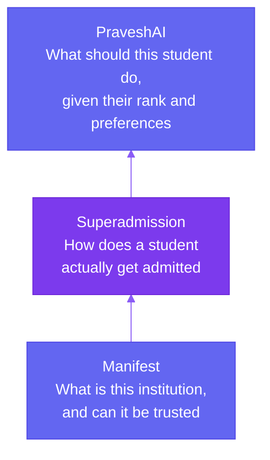

Every year, tens of millions of students in India go through college admissions using systems that each work exactly as designed, JoSAA, MCC, dozens of state counselling boards, and thousands of individual institutions, and still come out of it having typed the same information into four different websites, uploaded the same documents four times, and nearly missed a deadline because nothing told them two systems' windows were closing on the same day.

This whitepaper is about three things built to fix that, without touching who actually gets which seat.

## The Three Layers

<CardGroup cols={1}>
  <Card title="Manifest" icon="database">
    A verified registry of every degree-granting institution in India, more than 70,000 of them. It answers the question a student has before anything else: what is this college, and is it even real.
  </Card>

  <Card title="Superadmission" icon="layer-group">
    The coordination layer that sits above JoSAA, MCC, and every state counselling body. It doesn't run counselling and it doesn't decide who gets which seat. It removes the repeated work a student currently does by hand between those systems, one profile, one document vault, one dashboard, instead of a separate version of each per counselling body.
  </Card>

  <Card title="PraveshAI" icon="brain">
    The engine underneath Superadmission that does the actual thinking: verifying identity and documents, estimating a student's real odds at a given college, matching students to seats, and keeping every deadline in sync.
  </Card>
</CardGroup>

## What Doesn't Change

JoSAA still allocates IIT and NIT seats. MCC still allocates AIQ medical seats. Every state CET still allocates seats within its own state, under its own rules. None of that is proposed to change, and none of it is this project's decision to make. What's proposed to change is everything that currently happens before and between those systems, repeated forms, repeated uploads, and deadlines nobody is actually watching together. That full comparison is covered on What Superadmission Actually Changes.

## Where to Start, Depending on Who You Are

<Tabs>
  <Tab title="Students">
    Start with How Admissions in India Actually Works for the basics, then Counselling for the full step-by-step process. What Superadmission Actually Changes and A Day With Superadmission cover what's actually different when Superadmission is involved.
  </Tab>
  <Tab title="Counselling Authorities">
    How a Counselling Authority Actually Runs a Round covers round configuration, the verification queue, allocation triggers, and publication controls. How Superadmission Protects Student Data covers DPDP, consent, and data retention.
  </Tab>
  <Tab title="Institutions">
    How Institutions Actually Plug In covers the two touchpoints an institution actually has, a pre-verified allotment record delivered on payment confirmation, and a QR scan at physical reporting. No portal rebuild required.
  </Tab>
  <Tab title="Government and Policy">
    Superadmission as Digital Public Infrastructure covers the India Stack alignment and design intent. What This Depends On covers the real regulatory approvals and authority cooperation this would actually require.
  </Tab>
</Tabs>

<CardGroup cols={2}>
  <Card title="Start With the Problem" href="/how-admissions-in-india-actually-works">
    To understand how admissions actually work today.
  </Card>

  <Card title="Talk to the Founders" href="https://superadmission.com/contact">
    Click to start a direct conversation.
  </Card>
</CardGroup>
