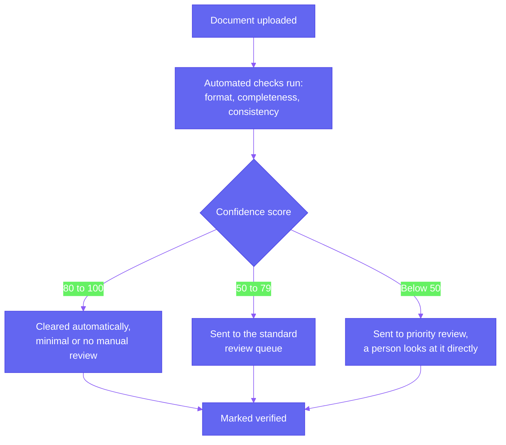
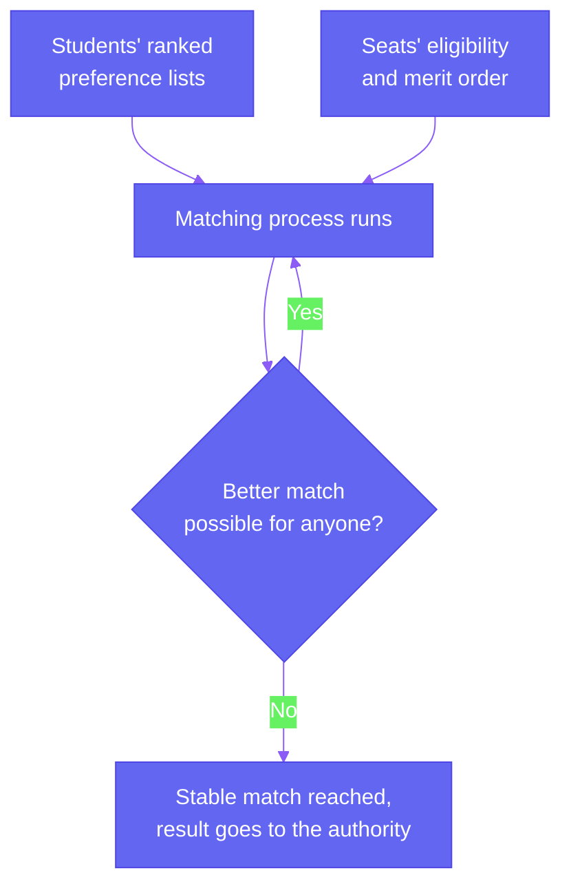

Everything on this page runs quietly underneath the profile and dashboard a student actually sees. None of it requires understanding how any of it works to use it, but it's worth explaining properly rather than leaving it as a black box.

## One Profile, Verified Once

A student verifies their identity through an <Tooltip tip="India's national biometric identity system">Aadhaar</Tooltip>-linked <Tooltip tip="One-time password, a short code sent to a registered mobile number to confirm identity">OTP</Tooltip>, the same method already used across most government services. This confirms who someone is without ever storing their Aadhaar number or any biometric data, only a verified yes-or-no status. A student without Aadhaar, or who doesn't want to use it, verifies through an alternate route instead, so this never becomes a hard requirement just to participate.

Once verified, a student's name, date of birth, and category are confirmed a single time. Every counselling system connected afterward reads from that same profile, instead of asking for the same details all over again.

<Accordion title="What a student actually controls">
  <CardGroup cols={2}>
    <Card title="Which systems to connect" icon="link">
      Connecting to JoSAA doesn't automatically connect to a state CET too. Each one is its own decision.
    </Card>

    <Card title="Which documents to share" icon="folder-open">
      A document verified once doesn't get shared with every connected system automatically.
    </Card>

    <Card title="Editing preferences before locking" icon="pen">
      Anything entered can be changed freely until it's actually locked in.
    </Card>

    <Card title="Confirming actions like accepting a seat" icon="square-check">
      Nothing that affects a real outcome happens without a student explicitly confirming it.
    </Card>
  </CardGroup>

  Each of these can be undone independently, the same way it was granted. Support is also available in more than one Indian language, since a portal that only works in English is a real barrier for a lot of applicants, not a minor inconvenience.
</Accordion>

## One Document, Checked Once

A document either gets fetched directly from <Tooltip tip="India's government-run digital document locker, where boards and universities place signed, verified copies of certificates directly">DigiLocker</Tooltip>, already signed by the board or university that issued it, or gets uploaded manually where it isn't available there yet. A manually uploaded document is automatically checked for format, completeness, and consistency, name matching across every other document submitted, certificate numbers formatted correctly, a scan that's actually readable, and this produces a confidence score that decides what happens next.

<Accordion title="What happens on rejection">
  If a document is rejected, whether by the automated check or by a person, the student is told specifically why, a mismatch, an unreadable scan, a missing page, not just "rejected." Resubmitting a corrected version goes through the same process again. If a student believes a rejection was actually wrong, that's a dispute, handled the same way any other one is on How a Dispute Actually Gets Resolved.
</Accordion>

Once verified, that status is shared rather than rechecked. JoSAA and a state CET both see the same "verified" mark from the same single check, which is the entire point of doing this once instead of three or four times.

## Realistic Odds, Not Guesses

When a student is building their preference list, a probability appears next to each option. It's based on the student's own rank and category, past-year closing ranks for that specific programme, the current seat matrix, and how much that cutoff has historically moved year to year.

<Accordion title="Why it's shown as a band, not a precise number">
  A rank comfortably inside every past cutoff shows as a high chance. One right at the edge of where cutoffs have historically landed shows as moderate. One well beyond any past cutoff shows as low. It's shown this way on purpose, a number like "73% chance" would suggest a level of certainty the underlying data doesn't actually support. As more information comes in during a round, these estimates update accordingly.
</Accordion>

<Warning>
  This is a historical estimate. A rank that would have cleared a cutoff last year isn't certain to clear it this year, demand shifts and seat counts change every cycle.
</Warning>

It doesn't add, remove, or reorder anything on a student's list, and it doesn't lock a choice in on their behalf. It's the same kind of advice a paid consultant would give, based on real historical data, available to every student at every decision point, not just the ones who can afford one.

## Matching Students to Seats

This is the part that actually decides who gets which seat, using an approach called <Tooltip tip="An algorithm that matches two groups, here students and seats, by having each side make and reconsider proposals until no better match is possible for anyone">deferred acceptance</Tooltip>, already the basis for how JoSAA and most state counselling bodies run their own allocation today.

Each student has a ranked list of seats they'd accept. Each seat has a ranked list of students it would accept, by merit and eligibility. Students provisionally match to their best available option, and if someone with a better rank later wants the same seat, they can bump someone with a lower rank, who then moves to their next preference. This continues until nobody can be matched any better, a point called a stable match.

Category and reservation rules aren't applied afterward, they're built into each seat's eligibility from the start, so a reserved seat simply never appears as an option for a student outside that category. This same approach can process well over a million applications in under an hour. What comes out is a proposed result, not a published one, it goes to the authority for review, and nothing reaches a student until the authority signs off, covered in full on How a Counselling Authority Actually Runs a Round.

## Keeping Every Deadline in Sync

Two counselling systems a student is registered with almost never share a calendar. A JoSAA deadline and a state CET deadline can land within hours of each other with nothing connecting the two, which is exactly the coordination gap described earlier in this whitepaper.

Every deadline a student is actually subject to, across every system they're connected to, is watched and surfaced together on one dashboard, sorted by urgency rather than by which portal it happens to belong to. Where two deadlines sit close enough that missing one is a real risk, that's flagged in advance, not discovered after the fact.

> One student might have a JoSAA acceptance window closing at 11:59 PM on a Tuesday, and a state CET window closing at 5:00 PM two days later. Looked at separately, both look like a comfortable three-day window. Shown together, it's immediately clear the real decision has to be made well before the first one closes, not right up against either deadline.

This works the same way for status, not just dates. If a seat is accepted in one system, the dashboard shows exactly what that means for a seat currently held in another, instead of leaving a student to work out the consequence on their own.
