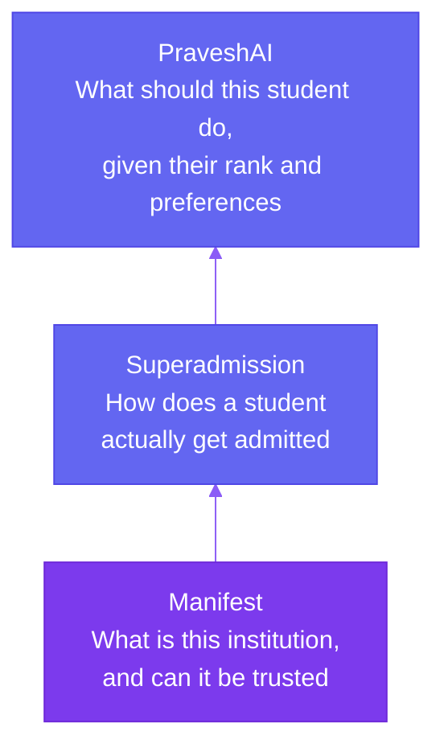
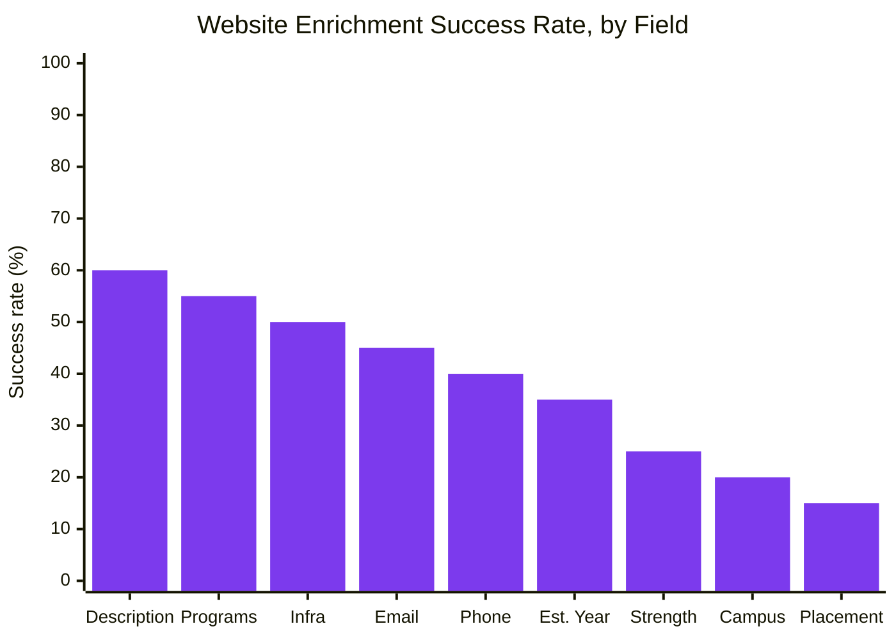

Manifest is a registry of every degree-granting higher education institution in India, more than 70,000 universities, colleges, and standalone institutions across 36 states and union territories, broken down as 1,362 universities, 52,509 affiliated colleges, 16,671 standalone institutions, and 2,467 constituent colleges, with 49,071 of them already carrying enriched profile data. AIDRA LLP builds and maintains it as the data layer underneath Superadmission.

## Where This Fits

Superadmission is built as three layers, and each one depends on the one below it.

Superadmission can't simplify admissions without solving discovery first, and PraveshAI can't give trustworthy advice without a real dataset underneath it. Manifest is what makes both of those things possible.

## The Actual Problem This Solves

Every year, tens of millions of students in India pick a college without a single trustworthy source telling them what it costs, what its outcomes are, or whether it's even a properly recognised institution.

<CardGroup cols={2}>
  <Card title="Visibility is usually sold, not earned" icon="triangle-exclamation">
    Most existing discovery sites rank whichever institution pays the most, not whichever one actually performs best.
  </Card>

  <Card title="Government data doesn't talk to itself" icon="puzzle-piece">
    Real data already exists across <Tooltip tip="All India Survey on Higher Education, the government's annual census of every institution">AISHE</Tooltip>, <Tooltip tip="National Institutional Ranking Framework">NIRF</Tooltip>, <Tooltip tip="National Assessment and Accreditation Council">NAAC</Tooltip>, <Tooltip tip="University Grants Commission">UGC</Tooltip>, and <Tooltip tip="All India Council for Technical Education">AICTE</Tooltip>, just spread across five incompatible formats with no shared key.
  </Card>

  <Card title="Fake institutions aren't flagged where it matters" icon="ban">
    There's no clear, prominent signal at the exact moment a student is deciding whether a college is even real.
  </Card>

  <Card title="Reservation data hides in PDFs" icon="file">
    Quota details often surface mid-cycle, in documents that assume prior knowledge most first-generation applicants don't have.
  </Card>
</CardGroup>

## How It Stays Neutral

The design borrows an idea from UPI and ONDC, government-backed systems built as shared infrastructure instead of a product competing for attention. A bank doesn't get better placement on UPI for paying more, and Manifest works the same way: rankings always come from a government metric or a clearly disclosed method, never from payment. The underlying data is exposed through a public API, so anyone can build on it, not just view it through Manifest's own site. A weak or negative recognition status is shown as prominently as the institution's own name, never buried. And Manifest doesn't charge institutions to be listed or ranked, any revenue sits entirely outside the registry itself.

## What's Actually Tracked, Per Institution

Every institution is keyed to its AISHE code, the government's own identifier, which is what prevents duplicate entries and keeps every record checkable against the source at any time. More than 80 fields are tracked per institution, grouped into three practical buckets:

<CardGroup cols={3}>
  <Card title="Who and where" icon="id-card">
    Identity, location, and contact details, mostly straight from AISHE, with contact info filled in through web enrichment.
  </Card>

  <Card title="How good is it" icon="ranking-star">
    NIRF rank across nine categories, NAAC grade and CGPA, NBA accreditation, and approval status.
  </Card>

  <Card title="What to actually expect" icon="briefcase">
    Placements, infrastructure, programs offered, and general content like photos and campus life, all filled in through web enrichment.
  </Card>
</CardGroup>

Program data sits in its own table underneath each institution, so a student can move from a college's overview straight down to one specific course, its seats, and its actual fee, without leaving that institution's profile. Put together, a full institution profile covers 14 areas: overview, admissions, courses and fees, cutoffs, placements, faculty, infrastructure, hostels, scholarships, rankings, recognition, a photo gallery, contact details, and FAQs.

<Note>
  A blank field means that fact hasn't been verified yet, not that the institution doesn't have it. Every record shows exactly how complete it is and when it was last checked.
</Note>

## Getting Into a Specific Program

Cutoffs aren't stored as one number per college. They're broken down by course, year, category, and quota, which is what makes it possible to give a specific student a specific estimate instead of a vague one. Reservation seat matrices and domicile requirements are tracked the same explicit way, rather than left inside a PDF a student has to track down and interpret alone.

This is also the exact data PraveshAI reads first when estimating a student's odds at a given college: it takes the student's rank and category, filters cutoffs down to what that rank could plausibly reach, narrows further by stream and quota, sorts what's left by NIRF rank, and returns the result together with the actual cutoff numbers behind it. How that estimate actually gets shown to a student is covered on How the Odds Shown to a Student Actually Get Calculated.

Cost works the same way. Fees are tracked at the course level, not per institution, since two programs at the same college can cost very differently, each course carrying its own name, level, annual tuition, and seat count, and scholarships, government and institutional, sit right alongside that fee data with their own eligibility and amount.

## Finding and Comparing a College

A student can search by name, city, state, program, or entrance exam with no account needed, then narrow results with filters covering location, discipline, institution type, ownership, ranking, accreditation, fees, placements, and more. Results sort by relevance, rank, fees, placements, or how recently a record was updated, and the homepage surfaces featured, trending, and top-ranked institutions for anyone who'd rather browse than search. Search is moving toward genuine natural-language queries next, something like "best CSE colleges under 2 lakh fees in Delhi," though every answer will still trace back to the same verified registry described above.

Up to three institutions can be compared side by side across rankings, fees, placements, courses, faculty, infrastructure, and scholarships, with the better value in each row highlighted automatically, and the finished comparison can be exported as a PDF or shared as a link. Institutions can also be saved to a shortlist while browsing, with no login required, and pulled straight into a comparison later.

## Where the Data Actually Comes From

Institutions are seeded directly from AISHE's own dataset, keyed by AISHE code so nothing duplicates, with NIRF rankings and a hand-verified set of top institutions layered on top. Everything government data doesn't cover, contact details, placements, infrastructure, program lists, comes from a pipeline that reads an institution's own website directly, and how well that works depends heavily on the field.

Roughly 40 to 60 percent of institution websites fail to yield usable data for a given field, and that's expected rather than a sign something's broken, a lot of listed URLs are outdated, some sites need a full browser render rather than a simple fetch, and some servers just aren't reachable at the time. NIRF-ranked institutions tend to maintain stronger websites, so enrichment succeeds above 85 percent for them, and those are prioritised first, which means the most-viewed profiles also tend to be the most complete ones.

Where a UGC or AICTE recognition status is unclear or negative, that's shown as prominently as the institution's own name, not tucked into a sub-section. And it's worth being precise about what "verified" actually means here: it means a fact traces back to a government source or a clearly disclosed enrichment method, not that a person has manually checked every single field by hand.
