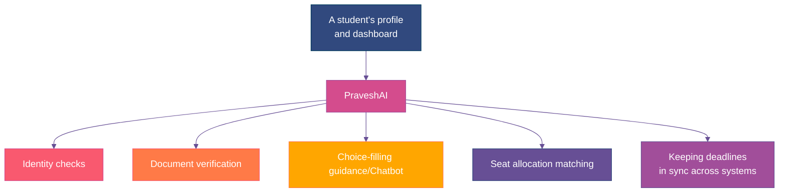

PraveshAI estimates a student's odds for each college on their list. It flags that a document is already verified. It keeps a dashboard in sync across two counselling systems. 

The most important thing to get right about PraveshAI isn't how clever it is. It's what it's actually allowed to decide on its own, and what it isn't.

## What It Actually Is

PraveshAI isn't a separate product a student signs up for. It's the part of Superadmission that does the thinking work underneath the profile, the dashboard, and the choice-filling screen already in front of them. Everywhere this whitepaper described something happening automatically, checking a document, calculating an odds estimate, keeping two systems' deadlines in sync, PraveshAI is the thing that actually did it.

## What It Actually Does

<CardGroup cols={2}>
  <Card title="Identity and Profile" icon="user-check">
    Verifies who a student is once, and keeps that single verified profile as the thing every connected counselling system reads from.
  </Card>

  <Card title="Document Workflows" icon="folder-check">
    Checks documents for completeness and consistency, pulls what it can directly from DigiLocker, and sends anything genuinely uncertain to a human reviewer instead of guessing.
  </Card>

  <Card title="Guidance and Support" icon="compass">
    Shows realistic odds for each choice being considered, based on rank, category, and real past-year cutoffs, without making the choice for anyone.
  </Card>

  <Card title="Smart Alerts" icon="clock">
    Watches every deadline a student is subject to across every system they're connected to, and warns them before two of those deadlines collide.
  </Card>

  <Card title="A Chatbot Grounded in Verified Data" icon="comments">
    Answers direct questions about any course or college from Manifest's verified registry, and personalised "which is better for me" questions using only what a student has actually shared in their profile.
  </Card>
</CardGroup>

## What It's Not Allowed to Decide by Itself

PraveshAI does not publish an allotment on its own, a counselling authority reviews and authorises that before it goes out. It does not make a final call on a document it's uncertain about, that goes to a person. It does not resolve a grievance, that goes to a human reviewer too. Anywhere a decision genuinely affects whether a student gets a seat, there's a person who reviews it before it becomes final.

<Info>
  Exactly where those human checkpoints sit, and what happens when something looks wrong, is covered properly in the Trust section next. 
</Info>

## Where the Rest of This Section Goes

The next page, Core Capabilities, goes through everything listed above in real detail: how a profile actually gets created and verified, how a document goes from upload to "verified," how the guidance numbers are actually calculated, how seat matching works, and how deadlines stay in sync across systems that don't talk to each other on their own.
