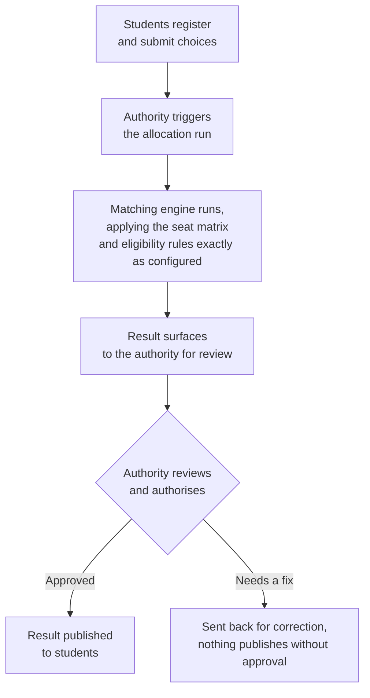

## Setting Up a Round

<Steps>
  <Step title="Configure the seat matrix">
    How many seats exist, split by programme, category, and any special quotas. This comes directly from the authority, nothing here is inferred or estimated.
  </Step>
  <Step title="Set eligibility rules">
    Minimum rank or percentile cutoffs, domicile requirements, any exam-specific conditions. These are the authority's existing rules, entered once and then applied consistently every round.
  </Step>
  <Step title="Set the round structure">
    How many rounds there will be, what each round's deadlines are, and how choices carry forward or drop between rounds.
  </Step>
</Steps>

## Running a Round

The matching itself runs fast enough that scale isn't the bottleneck, the same underlying engine can process well over a million applications in under an hour. What comes out the other end doesn't go to students automatically. It goes to the authority first, for review and sign-off.

## What Stays in the Authority's Hands, Always

<CardGroup cols={2}>
  <Card title="Eligibility rules" icon="clipboard-check">
    Set by the authority, applied exactly as configured, never adjusted automatically.
  </Card>

  <Card title="Reservation mandates" icon="armchair">
    Category percentages and quotas are the authority's own policy, not a default the system supplies.
  </Card>

  <Card title="The seat matrix" icon="table-cells">
    How many seats exist and where, entered and updated only by the authority.
  </Card>

  <Card title="Round timing and publication" icon="calendar-check">
    When a round opens, closes, and when a result actually goes live, all require the authority's own action.
  </Card>
</CardGroup>

## The Verification Queue an Authority Actually Sees

Documents are scored and triaged before they ever reach a human, most get cleared automatically and only genuinely uncertain cases are surfaced. Exactly how that scoring works is covered on **Document Workflows**. What an authority sees here is the short list that already needs an actual person's judgment, not a pile of routine checks.

## If Something Needs to Change Mid-Round

Pausing a round, extending a deadline, or rolling back a result that was published in error are all real possibilities, and they're handled as a distinct set of controls rather than something buried in the normal flow above.
