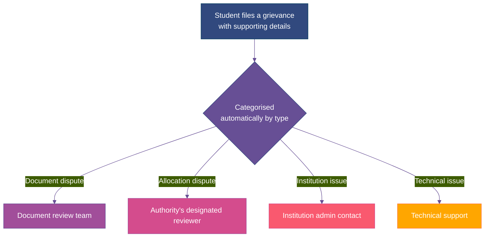

Even with documents pre-verified and deadlines tracked automatically, disagreements still happen. A document gets rejected and the student thinks that's wrong. An allotment looks like it doesn't match the rules. This page is about what happens when that occurs.

## What Counts as a Grievance

<CardGroup cols={2}>
  <Card title="A document dispute" icon="file-circle-question">
    A document was rejected or flagged, and the student believes it's actually valid.
  </Card>

  <Card title="An allocation dispute" icon="scale-unbalanced">
    A student believes their allotment doesn't match the rules that were supposed to apply, a rank, a category, or a reservation calculation.
  </Card>

  <Card title="An institution-level issue" icon="building">
    Something went wrong specifically at reporting, a mismatch, a payment that didn't register correctly.
  </Card>

  <Card title="A technical issue" icon="bug">
    The dashboard showed something incorrect, or a deadline notification didn't arrive as it should have.
  </Card>
</CardGroup>

## How It Gets Routed

A grievance isn't dropped into one general queue for someone to eventually sort through. It's categorised by what it's actually about at the moment it's filed, and sent straight to whoever is positioned to actually resolve that specific kind of issue.

## If It Isn't Resolved

<Steps>
  <Step title="First-line review">
    The relevant reviewer looks at the specific dispute and responds within a set window.
  </Step>
  <Step title="Senior review, if the student isn't satisfied">
    If the first response doesn't resolve it, or the student disputes the outcome, it moves to a senior reviewer with more context and more authority to act.
  </Step>
  <Step title="The authority's grievance officer, as the final internal step">
    DPDP already requires every data fiduciary to have a designated grievance officer for data-related complaints. That same role, or an equivalent one for admission-specific disputes, is the final point of escalation before anything would need to go outside the system entirely.
  </Step>
</Steps>

Each level has its own timeline, and a student can see exactly where their grievance currently sits and how long the current step is expected to take, instead of submitting it and hearing nothing until someone happens to look at it.

## What's Kept on Record

Every grievance, every response, and every escalation is logged with a timestamp, the same way every other action in the system is. That's covered in full on **Audit and Explainability**, rather than repeated here.
