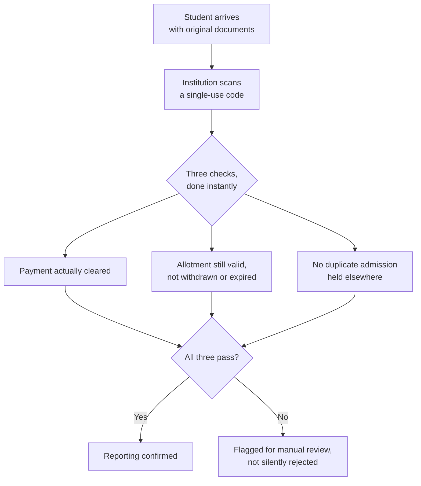

The case for why this matters to an institution is covered on [What This Looks Like for the Authorities Running It.](https://docs.superadmission.com/the-problem/what-this-looks-like-for-the-people-running-it) This page is the other half: the actual mechanics of how an institution's side of this works, step by step.

An institution's involvement comes down to two moments.

## Moment One: A Confirmed Allotment Arrives

The instant a student's payment clears for a seat at that institution, a record is sent over automatically. It isn't just a name on a list, it includes everything the institution would otherwise have to chase down separately:

<CardGroup cols={2}>
  <Card title="Identity and category" icon="id-card">
    The student's verified identity and the specific category their seat falls under.
  </Card>

  <Card title="Programme and round" icon="graduation-cap">
    Which programme, and which round of counselling the seat was allotted in.
  </Card>

  <Card title="Document status" icon="folder-check">
    Confirmation that the required documents are already verified, with a reference to each one, not the raw files themselves unless the institution specifically needs them.
  </Card>

  <Card title="Payment confirmation" icon="indian-rupee-sign">
    Proof that the seat-confirmation payment has actually cleared, not just been initiated.
  </Card>
</CardGroup>

Nothing here requires the institution to change how it manages its own student records internally. This is additional information arriving early, not a replacement for whatever system the institution already runs.

## Moment Two: Reporting Day

The student still shows up in person with original documents, exactly as they would without any of this. What's different is what happens when they arrive.

If all three checks pass, reporting is confirmed on the spot. If something doesn't line up, a genuine payment delay, a seat that was withdrawn minutes earlier elsewhere, it gets flagged for a staff member to look at directly. The student isn't turned away automatically, the system just makes sure the person checking them in knows exactly what to verify by hand.

## If a Seat Goes Unclaimed

If the reporting window closes and a seat was never confirmed, that seat is reported back into the system automatically. This is what feeds the next round or a spot round, instead of an institution's admissions office having to notice and manually report an empty seat days later.

## What Institutions Don't Need to Change

<Steps>
  <Step title="Internal record systems stay as they are">
    However an institution manages its own student database internally is unaffected. This is an additional feed of already-verified information, not a system replacing it.
  </Step>
  <Step title="Fee collection and academic evaluation stay as they are">
    Everything after admission, tuition, orientation, academic processes, continues exactly as it currently runs.
  </Step>
  <Step title="Reporting to an affiliating body stays as they are">
    Whatever an institution already reports to its university, board, or regulator is unchanged. This system doesn't sit between an institution and its regulator.
  </Step>
</Steps>

## Two Ways to Actually Connect

An institution doesn't need a technical team to participate at a basic level. Confirmed allotments and reporting-day checks can be handled through a simple web view, no integration required. An institution with its own systems and the appetite for it can instead connect through an API, so confirmed allotments flow directly into its own student database without anyone re-entering anything by hand. Both are fully supported, and an institution can start with the first and move to the second later without losing anything already set up.
