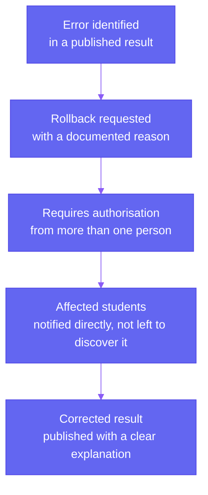

Most of a round runs exactly the way the previous pages describe, configure, run, review, publish. This page is about the exceptions: what happens when something needs to change mid-round, or after a result has already gone out.

## Pause

A round can be paused if something concrete goes wrong, a technical failure during a run, a legal order requiring a hold, or a sudden spike in grievances pointing to a genuine error rather than routine disagreement. A pause isn't a silent freeze. Students see a clear message explaining that the round is paused and, where possible, roughly when it's expected to resume, rather than a dashboard that simply stops updating with no explanation.

## Extend

If a deadline needs more time, whether because of a technical issue or a decision by the authority, the extension is applied and every affected student is notified immediately, on the same dashboard that was already showing them the original deadline.

## Close

A round closes either on schedule or early, if the authority decides it's served its purpose. Closing is treated as a deliberate action taken by the authority, not something that happens automatically without a clear record of who ended it and when.

## Rollback

This is the most disruptive action available, and it's treated that way on purpose. If a result was published in error, reversing it means undoing something students may have already acted on, accepted a seat, started arranging travel, told their family. Because of that, a rollback isn't a single click.

A rollback requires more than one authorised person to approve it, specifically because a single person acting alone on something this disruptive is a bigger risk than the delay caused by requiring a second signature. Every student affected is notified directly and told plainly what changed and why, rather than finding out by noticing their dashboard looks different.

## Every One of These Is Logged

Pausing, extending, closing, and rolling back are all recorded the same way every other action in the system is, who did it, when, and why. That full record is covered on **Audit and Explainability**.
