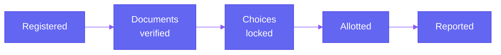

Running a round is covered on the previous page. This page is about visibility, what an authority can actually see while a round is open, instead of finding out how it went only after it closes.

## A Live View of the Round, Not Just the Final Number

At any point while a round is open, an authority can see how many students sit at each stage of this funnel, not just a final count once everything's done. A large gap between "documents verified" and "choices locked," for instance, is a visible signal that students are stalling at a specific step, while the round is still open to actually do something about it.

## Seat Fill Tracking, by Category and Institute

Beyond the student-side funnel, an authority can see how seats are filling in real time, broken down by category and by institute. This is what makes it possible to notice, mid-round, that a specific category or a specific institute is under-filling, instead of only discovering it once the round has already closed and the options for fixing it have narrowed.

## Alerts, When Something Actually Needs Attention

<CardGroup cols={2}>
  <Card title="An allocation run fails" icon="triangle-exclamation">
    If a run doesn't complete successfully, the authority is alerted within roughly 60 seconds, not left to notice a missing result on their own.
  </Card>

  <Card title="The verification queue backs up" icon="clock">
    If genuinely uncertain documents are piling up faster than reviewers are clearing them, an alert flags it before it turns into a bottleneck at the deadline.
  </Card>

  <Card title="A deadline is approaching with a large gap remaining" icon="hourglass-half">
    If a meaningful share of registered students haven't locked their choices as a deadline nears, the authority sees this ahead of time, not after the window has already closed.
  </Card>
</CardGroup>

## Comparing This Round Against the Last One

Every round leaves behind the same kind of data: how long verification took, how many grievances came in, how close the fill rate got to full capacity. Seeing this round next to the last one is what actually makes each cycle easier to run than the one before it, an authority can tell whether a change they made, like adjusting a deadline or adding reviewers, actually helped.

---

Everything visible here is a view into what's happening, not a control over it. Actually pausing, extending, or correcting a round is covered next, on **Operational Controls**.
