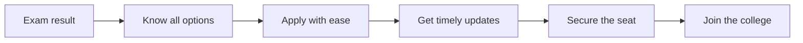

Every year, crores of students in India try to get into college. Getting a good score in competetive exam is hard but atleast getting the seat that the score deserves should be easy. 

## India's admissions in numbers

<CardGroup cols={4}>
  <Card title="1.5 crore+" icon="users">
    Students in every admission cycle
  </Card>

  <Card title="150+" icon="file-pen">
    Entrance exams at national, state and university level
  </Card>

  <Card title="40+" icon="door-open">
    Counselling portals
  </Card>

  <Card title="58,000+" icon="grip">
    Institutions offering hundreds of courses
  </Card>
</CardGroup>

## Problem Statement

A student works for months or years to clear an entrance exam. Then the exam result comes, and a new race begins. The student has to work with multiple websites, logins, deadlines and fees. Each website looks different and follows different rules.

Nobody teaches students how to do this. Families learn it by trying, and many make mistakes. A small mistake, a slow website or a blurry photo can cost a student a seat that they earned with hard work.

In short: **students with merit lose seats because the admission system is hard to use.**

## Things that go wrong

<AccordionGroup>
  <Accordion title="2. There is no single path" icon="route">
    A student may take one to three exams and then face multiple counselling portals. An engineering student, for example, may use JoSAA, state portals and university portals all at once.

    Students with average ranks have the hardest time. They apply in many places to keep their chances open. That means many logins, many dates and many fees, all in separate tabs.
  </Accordion>

  <Accordion title="5. Good guidance is not accessible to all" icon="compass">
    There is no single trusted place to learn about colleges, fees, dates and documents. Most students depend on YouTube videos and advice from people they know.

    First-generation students have the hardest time, because nobody at home has been through counselling before. Many choose a college nearby with lower quality even when their score is high. Some families pay private agents for basic clarity. Good guidance should be free for every student.
  </Accordion>

  <Accordion title="4. The same details are filled repeatedly" icon="copy">
    Each portal asks for a new account. Each one asks for the same name, family details, scorecards and more. Applying to five colleges means filling five forms with the same information.

    Documents must be uploaded again on every site, and every site has its own rules for file type and size. Families spend days changing files and uploading the same papers.
  </Accordion>

  <Accordion title="3. Important updates are easy to miss" icon="alarm-clock-check">
    Students use 2 to 6 portals at the same time in admission season. Cut-off marks, document errors and payment deadlines are posted on the notice boards of separate websites. There is no single place that tells the student what changed.

    In spot rounds, colleges fill empty seats very fast. Sometimes a student gets less than 24 hours to see the notice and reach the campus. Many students miss good seats only because they did not see a notice in time.
  </Accordion>

  <Accordion title="1. Students lose seats because of technical problems" icon="book-open-text">
    Many portals log students out after a few minutes. If a student takes a short break to talk to their parents, all the choices they filled can disappear.

    Payments also fail. Sometimes the money leaves the bank account, but the college website still shows the fee as unpaid. The system then cancels the seat, and no person checks it.

    Document uploads cause trouble too. Photos from a phone are too big, so students shrink them. The shrunk files look blurry, and the website rejects them.
  </Accordion>

  <Accordion title="6. Websites stop working when most students need them" icon="server">
    When results or seat lists come out, lakhs of students open the same link at the same time. The pages freeze, show errors or do not load.

    This is most painful in the last hours of a round. A student may need to pay a fee or confirm a choice before the deadline, but the page keeps loading. A food delivery app can handle millions of people at once. A national admission website should be able to do the same.
  </Accordion>
</AccordionGroup>

## What Is Our Mission?

> **A student should not need to become an expert in India's admission system to get the seat they deserve.**

We want college admission in India to be simple, fair and clear for everyone involved. A student with merit should get a seat. A student from a small town should have the same information as a student from a big city. A family should never lose a seat because of a slow website or a missed deadline.

## What the future looks like

<Columns cols={2}>
  <Card title="For students" icon="graduation-cap">
    One place to see every exam, every counselling round and every deadline. Clear next steps at every stage. Good guidance for free.
  </Card>

  <Card title="For counselling bodies" icon="landmark">
    Fewer errors in forms and documents. Less manual load. Better information for students before they apply. 
  </Card>

  <Card title="For institutes" icon="school">
    Alocation mechanism and Smart alerts that make sure seats get occupied by right students on the right time.. Fewer vacant seats after the counselling end.
  </Card>

  <Card title="For the government" icon="flag">
    An admission system that works well at a large scale. Every student counts, and every step can be seen and checked.
  </Card>
</Columns>

## The journey we want for every student

## What we believe

<Steps>
  <Step title="Merit should decide the seat">
  </Step>
  <Step title="Every student deserves the same information">
    A first-generation student should know as much as a student with a private counsellor.
  </Step>
  <Step title="Time belongs to students">
    Students should spend their time choosing the right college, not filling the same form again and again.
  </Step>
  <Step title="Trust comes from clarity">
    When every step is easy to see, students, families and institutions can trust the process.
  </Step>
</Steps>

## To Know How We do This:

<Card title="What Superadmission actually changes " icon="arrow-right" href="https://app.mintlify.com/superadmission/whitepaper/~/fec8b45e-0ca0-48ac-a479-2b9a57584a77">
  See how we turn this vision into a real product.
</Card>
