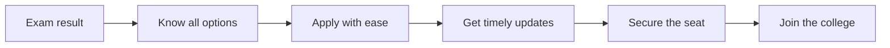

A student spends years preparing for one exam. They clear it. Their rank is good enough for the seat they worked for. And then, in the weeks that follow, a real number of them lose that seat anyway, not because they weren't good enough, but because a website logged them out, a payment didn't register, or a notice went up on a portal nobody told them to check. 

We built Superadmission because this isn't a rare story. It's a normal one, repeated at a scale that's hard to picture until you see the numbers behind it.

## India's admissions in numbers

<CardGroup cols={4}>
  <Card title="1.5 crore+" icon="users">
    Students in every admission cycle
  </Card>

  <Card title="150+" icon="file-pen">
    Entrance exams at national, state and university level
  </Card>

  <Card title="40+" icon="door-open">
    Counselling portals
  </Card>

  <Card title="58,000+" icon="grip">
    Institutions offering hundreds of courses
  </Card>
</CardGroup>

## Problem Statement

A student works for months or years to clear an entrance exam. Then the exam result comes, and a new race begins. The student has to work with multiple websites, logins, deadlines and fees. Each website looks different and follows different rules.

Nobody teaches students how to do this. Families learn it by trying, and many make mistakes. A small mistake, a slow website or a blurry photo can cost a student a seat that they earned with hard work.

In short: **students with merit lose seats because the admission system is hard to use.**

<AccordionGroup>
  <Accordion title="A student is rarely on just one portal" icon="route">
    An engineering aspirant with a decent rank might be using JoSAA, a state counselling portal, and a university's own system, all in the same week. Students with middle-of-the-pack ranks have it worst, since keeping every option open means juggling every one of these at once, each with its own login, its own dates, and its own fee.
  </Accordion>

  <Accordion title="The same information gets typed in again and again" icon="copy">
    Every new portal means a new account, and a new account means retyping the same name, the same family details, the same scorecard. Applying to five institutions can mean filling out the same information five separate times, and re-uploading the same documents five times, each site with its own rules for file size and format.
  </Accordion>

  <Accordion title="Updates that matter are easy to miss entirely" icon="alarm-clock-check">
    A student juggling two to six portals during admission season has no single place telling them what changed. A revised cutoff, a document flagged as invalid, a payment deadline, each one gets posted on a separate site's own notice board. In a spot round, where empty seats get filled fast, a student can have less than 24 hours to see a notice and act on it. Good seats get missed this way, not because a student wasn't eligible, but because they never saw the notice in time.
  </Accordion>

  <Accordion title="Technical failures cost real seats" icon="book-open-text">
    Portals often log a student out after a few idle minutes, and a short break to talk to a parent can wipe out every choice they'd filled in. Payments fail in ways that are worse than an error message, money leaves the account but the portal still shows the fee as unpaid, and the seat gets released with no one checking what actually happened. Even a document upload can go wrong for a reason that has nothing to do with the document itself, a phone photo too large for the site's limit, shrunk until it's blurry enough to get rejected.
  </Accordion>

  <Accordion title="The sites fail exactly when the most students need them" icon="server">
    When a result or a seat list goes live, lakhs of students try to open the same page within minutes of each other, and the page freezes or stops loading entirely. This tends to happen in the final hours of a round, exactly when a student is trying to confirm a choice or pay a fee before a deadline that doesn't care whether the page loaded. A food delivery app handles millions of simultaneous users without falling over. A national admissions system should be able to do the same.
  </Accordion>

  <Accordion title="Good guidance isn't available to everyone" icon="compass">
    There's no single trusted place for a student to learn what a college actually costs, what its deadlines are, or what documents it needs. Most students end up relying on YouTube videos and whatever advice happens to reach them. This hits first-generation applicants hardest, since nobody at home has been through the process before, and it's common for a strong scorer to settle for a weaker college nearby simply because it's the one they understand. Some families end up paying a private agent just for basic clarity that should never have cost anything.
  </Accordion>
</AccordionGroup>

## What We Believe

> **A student should not need to become an expert in India's admission system to get the seat they deserve.**

We want college admission in India to be simple, fair and clear for everyone involved. A student with merit should get a seat. A student from a small town should have the same information as a student from a big city. A family should never lose a seat because of a slow website or a missed deadline.

## What We're Actually Building

<Columns cols={2}>
  <Card title="For students" icon="graduation-cap">
    One place to see every exam, every counselling round, and every deadline that applies to them, with clear next steps at each stage, and real guidance available for free.
  </Card>

  <Card title="For counselling bodies" icon="landmark">
    Fewer errors in the forms and documents they have to process, less manual work overall, and students who arrive already informed instead of starting from zero.
  </Card>

  <Card title="For institutions" icon="school">
    An allocation process and timely alerts that get the right seats filled by the right students on time, and fewer seats sitting empty once counselling ends.
  </Card>

  <Card title="For the government" icon="flag">
    An admissions system that actually holds up at national scale, where every student counts and every step in the process can be seen and checked.
  </Card>
</Columns>

## The journey we want for every student

## To Know How We do This:

<Card title="What Superadmission actually changes " icon="arrow-right" href="https://app.mintlify.com/superadmission/whitepaper/~/fec8b45e-0ca0-48ac-a479-2b9a57584a77">
  See how we turn this vision into a real product.
</Card>
