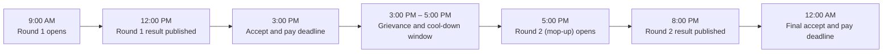

A <Tooltip tip="A final, fast-turnaround round run after the regular counselling rounds close, to fill whatever seats are still empty">spot round</Tooltip> is what happens after the regular rounds of a counselling process close and seats are still sitting empty. It's the last real chance to fill them before they're handed off entirely. How this actually runs today depends heavily on which counselling body you're dealing with.

## How Spot Rounds Actually Run Today

<CardGroup cols={3}>
  <Card title="State bodies" icon="map">
    JAC for engineering, state medical and architecture portals, and most others, run their spot rounds physically. Students show up in person.
  </Card>

  <Card title="JoSAA" icon="building-columns">
    Doesn't run its own spot round at all. Leftover seats go to CSAB, which runs a separate process for them.
  </Card>

  <Card title="MCC" icon="stethoscope">
    Runs its own spot round online directly, no physical presence required.
  </Card>
</CardGroup>

Whatever's still unfilled after all of this goes to the individual institutes, who can handle it however they choose, another round of their own, reaching out to students on the merit list, or anything else they see fit. That part doesn't change in anything described below.

## The Physical Version, Since It's the Model Being Digitised

Where spot rounds do run in person, the process is blunt and immediate: students queue physically, each one sees the current seat matrix update live as their turn approaches, picks an available seat on the spot, pays the fee immediately, and gets their documents verified right there. Nothing waits. Where spot rounds already run online today, MCC's for instance, the process mirrors an ordinary counselling round, just with a smaller seat matrix, only the colleges and courses nobody claimed. Choice filling, allotment, and accept-or-reject all work the same way, and in some counsellings, freeze, float, and slide are still options here too.

Any digital version worth building has to keep that same immediacy the physical version has, not the multi-day pace of a regular round.

## What's Actually Different Here

The core distinction isn't a new mechanic, it's giving every counselling body the ability to run this online, not just the two or three that already can. Beyond that, four things change:

<CardGroup cols={2}>
  <Card title="Results come back in hours, not days" icon="bolt">
    A regular round can take days to publish a result. A spot round here is built to return one in 3 hours or less.
  </Card>

  <Card title="No documents to verify on the spot" icon="folder-check">
    Physical spot rounds verify documents right there because there's no other option. Here, documents are already verified in the vault, covered on How a Document Actually Gets Verified, so that step simply isn't needed.
  </Card>

  <Card title="A short, fixed window to accept and pay" icon="hourglass-half">
    Once a result is out, a student gets roughly 2 to 3 hours to accept the seat and pay, the same immediacy as paying on the spot in a physical round, just given as a short window instead of an instant.
  </Card>

  <Card title="PraveshAI actually tells a student to show up" icon="bell">
    In a physical spot round, a student has to already know it's happening and be present. Here, because PraveshAI can see a student's dashboard across every counselling system they're connected to, covered on How Deadlines Stay in Sync Across Systems, a student who hasn't secured a seat yet and has a real chance in, say, a CSAB spot round gets a direct notification telling them so, and is guided through every deadline in it once they choose to participate.
  </Card>
</CardGroup>

## A Full Day, Worked Out

Because the whole thing is automated, more than one spot round can run in a single day. Here's a realistic example, assuming the final leftover seat matrix was published a day or two in advance so students have already logged in and filled their choices.

<Steps>
  <Step title="9:00 AM — Round 1 opens">
    Students who already filled their choices against the published leftover seat matrix enter the round.
  </Step>
  <Step title="12:00 PM — Round 1 result published">
    A 3-hour turnaround from open to result.
  </Step>
  <Step title="3:00 PM — Accept and pay deadline">
    Students who were allotted a seat have until this point to confirm and pay.
  </Step>
  <Step title="3:00 PM – 5:00 PM — Grievance and cool-down window">
    A 2-hour gap before the next round starts, for any discrepancy to be raised.
  </Step>
  <Step title="5:00 PM — Round 2 (mop-up) opens">
    Leftover seats from Round 1 roll straight into this round.
  </Step>
  <Step title="8:00 PM — Round 2 result published">
    Same 3-hour turnaround as Round 1.
  </Step>
  <Step title="12:00 AM — Final accept and pay deadline">
    End of day. Whatever's still unfilled moves to the next stage below.
  </Step>
</Steps>

Two full mop-up rounds, start to finish, inside one day. The entire digital spot round process is built to need no more than a single day in total.

## What's Still Left After That

Whatever seats remain empty once this is done go to the university directly, the same as they do today, whether the spot round that came before it was physical or digital. Nothing about that handoff changes.
