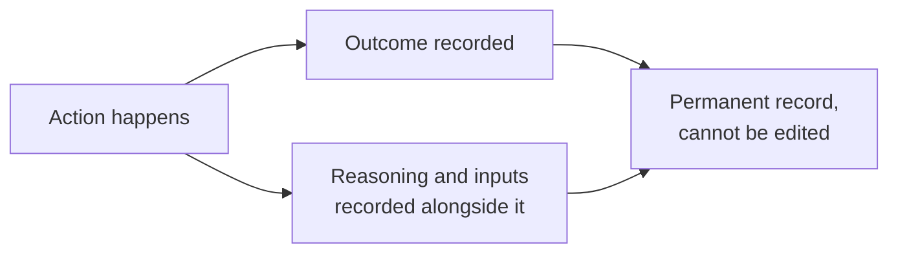

The previous page covered where a person has to sign off before something becomes final. This page is about the other half of trust: making sure that whatever happened, human decision or automated one, can be reconstructed and explained afterward.

## What gets recorded

Every meaningful action leaves a record such as  a document gets scored and cleared, a preference list gets locked or an authority authorises a result. Each entry says what happened, who did it or <Tooltip tip="Suppose a payment countdown i initiated because a student accepted a seat in spot round counselling so here the acceptance triggered the coutdown">what triggered it</Tooltip>, and when it took place.

Automated decisions get more than that. Take a document's confidence score or a proposed seat match. The system does not store only the final outcome. It also keeps the inputs that led to it, such as which past-year cutoffs were used and what score a document received and why.

This is what makes it possible to answer "why did this happen?" months later. Without those inputs, all anyone could say is what happened, with no way to explain the reasoning behind it.

## Uneditable

If something needs correcting later, a new record is added explaining the correction. The original entry stays exactly as it was. This matters because a log that can be quietly edited isn't actually a record of what happened.

## Who Can Actually See What

<CardGroup cols={2}>
  <Card title="A student" icon="user">
    Sees their own complete history, every action taken on their profile, their documents, and their applications.
  </Card>

  <Card title="An authority" icon="building-columns">
    Sees the actions that happened within its own counselling process, not another authority's records.
  </Card>

  <Card title="A designated compliance officer" icon="shield-check">
    Can access the full log if something genuinely needs investigating, the same grievance and data-protection officer role required under DPDP.
  </Card>
</CardGroup>
