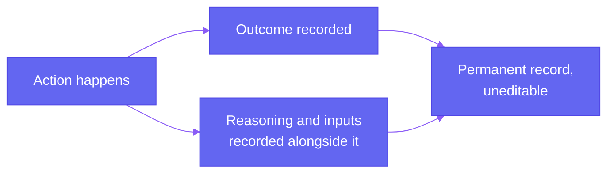

The previous page covered where a person has to sign off before something becomes final. This page is about the other half of trust: making sure that whatever happened, human decision or automated one, can be reconstructed and explained afterward.

## What Gets Recorded

Every meaningful action leaves a record such as a document getting scored and cleared, a preference list getting locked, an authority authorising a result. Each entry captures what happened, who did it or what triggered it, and when.

For an automated decision specifically, like a document's confidence score or a proposed seat match, what's stored isn't just the final outcome. The actual inputs that led to it, which past-year cutoffs were used, which score a document received and why, are kept alongside it. That's what makes it possible to answer "why did this happen" properly months later, instead of only being able to say "this is what happened," with no way to explain the reasoning behind it.

## Uneditable

If something needs correcting later, a new record is added explaining the correction. The original entry stays exactly as it was. This matters because a log that can be quietly edited isn't actually a record of what happened.

## Who Can Actually See What

<CardGroup cols={2}>
  <Card title="A student" icon="user">
    Sees their own complete history, every action taken on their profile, their documents, and their applications.
  </Card>

  <Card title="An authority" icon="building-columns">
    Sees the actions that happened within its own counselling process, not another authority's records.
  </Card>

  <Card title="A designated compliance officer" icon="shield-check">
    Can access the full log if something genuinely needs investigating, the same grievance and data-protection officer role required under DPDP.
  </Card>
</CardGroup>

## How Long This Is Kept

Allotment records and audit logs are retained for 7 years, long enough to cover institutional record-keeping needs and any regulatory review that might come up well after a cycle has closed.

---

Put together with the previous page, this is the full answer to "can this actually be trusted": a person signs off before anything consequential becomes final, and everything that happened, by a person or by the system, is recorded in enough detail to be explained afterward.
