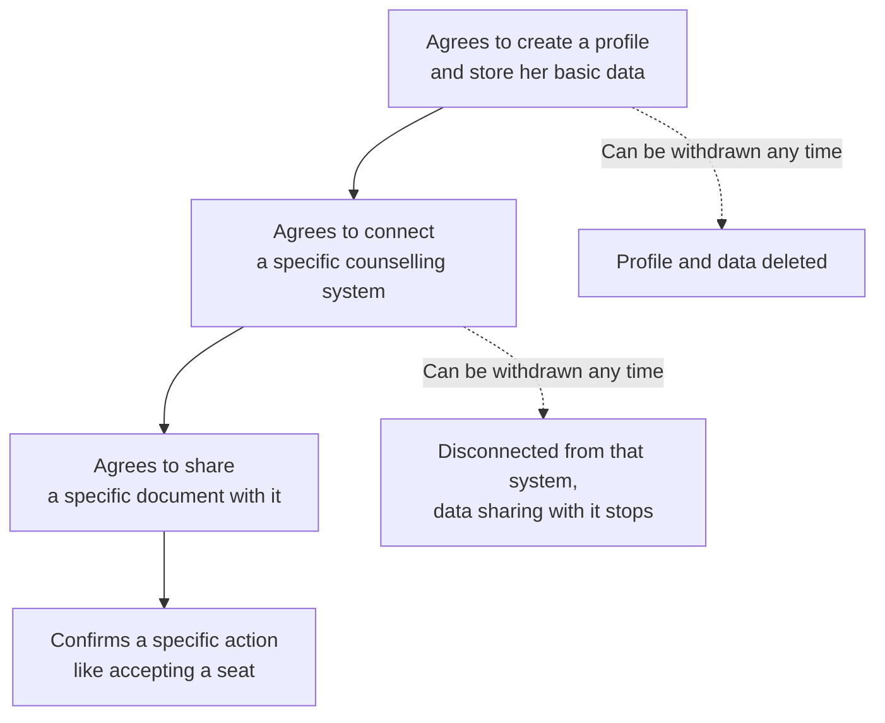

By the time Unnati has a working profile, Superadmission is holding her Aadhaar-linked identity, her category, her marksheets, her rank, and eventually her seat allotment. That's a lot of sensitive information about one person, and it's happening for millions of students at once.

India has specific laws about what's allowed to happen to information like that.

Two terms come up constantly in this area: the organisation holding and deciding what to do with someone's data is called a <Tooltip tip="The entity legally responsible for deciding why and how personal data is collected and used">data fiduciary</Tooltip>. The person the data is actually about, Unnati, is called a <Tooltip tip="The individual whose personal data is being collected and processed">data principal</Tooltip>. Superadmission is a data fiduciary. Unnati is a data principal. Every rule below is really about the obligations the first one has toward the second one.

---

## The Main Law: DPDP

The <Tooltip tip="Digital Personal Data Protection Act, passed in 2023, India's main law governing how personal data can be collected, used, and stored">DPDP Act</Tooltip> is the law that actually governs this. It's specific about what a data fiduciary has to do:

<CardGroup cols={2}>
  <Card title="Consent, asked properly" icon="hand">
    Unnati has to actively agree before her profile is created, and again before any specific document is shared with a specific counselling body. Not one blanket agreement buried in page nine of a terms of service.
  </Card>

  <Card title="Only for the reason it was collected" icon="target">
    If she shares her category certificate for seat allocation, it can't quietly be reused for something else later. Each piece of data is tied to why it was collected.
  </Card>

  <Card title="Only what's actually needed" color="#070606" icon="book-down">
    No collecting information "just in case it's useful later." If a field isn't required for the admission process, it isn't asked for.
  </Card>

  <Card title="Her data, her rights" icon="user-check">
    She can see everything held about her, ask for a correction if something's wrong, and request deletion. There's a specific person, a grievance officer, whose job is to handle these requests within a set time.
  </Card>
</CardGroup>

Two more things the Act requires, worth stating directly: Unnati's data is stored on servers inside India, not sent abroad. And the system has to have real security in place, encryption, access controls, and logs, not just a promise that it does.

<Note>
  The DPDP Rules, the detailed regulations that explain exactly how the Act is enforced, were still being finalised at the time this was written. Everything here describes what the Act itself requires. Once the Rules are notified, this page gets checked against them and updated if anything changes.
</Note>

## Category Data Gets Extra Care

Student's category, whether she's general, OBC-NCL, SC, ST, EWS, or PwD, decides which seats she's eligible for under reservation. Along with domicile and income certificates, this is treated with more caution than an ordinary field like her mobile number.

DPDP doesn't create a separate legal category for this kind of data the way some other countries' laws do. Superadmission handles it carefully anyway. So it's collected only where a seat's eligibility actually depends on it, it's never shared with a counselling body Unnati hasn't enrolled with, and the documents proving it sit behind stricter access controls than her photo or her marksheet.

## Two Older Laws That Still Apply

DPDP is the newest and most specific law here, but two older ones still matter.

The <Tooltip tip="India's foundational law on electronic records and cybersecurity, passed in 2000">IT Act, 2000</Tooltip> ensures electronic admission letters are legally valid. It also makes platforms liable for data breaches. To meet this standard, Superadmission encrypts all student data both in transit and at rest, while strictly controlling who can access it.

The <Tooltip tip="The 2016 law governing how Aadhaar, India's biometric identity system, can be used by outside organisations">Aadhaar Act</Tooltip> strictly regulates identity verification. Superadmission never stores Aadhaar numbers or biometric data, verification happens entirely inside UIDAI’s secure system. Furthermore, Aadhaar remains completely optional; students can always choose alternative ways to verify their identity.

## Consent is specific, not a blanket agreement.

DPDP's consent requirement, done properly, isn't a single checkbox. It works in layers, and each layer can be taken back independently of the others.

Agreeing to have a profile isn't the same as agreeing to share a document with JoSAA. Agreeing to share with JoSAA isn't the same as agreeing to accept a seat. Each consent is specific, written in plain language rather than legal wording, available in more than one Indian language, and stamped with the exact time it was given. If Unnati changes her mind about any single one of these, she can withdraw it without touching the others.

## How Long Data Is Actually Kept

Deleting everything the moment a cycle ends sounds privacy-friendly, but it isn't practical. A student sometimes needs to dispute a decision, or an authority needs to investigate a grievance, months after a cycle has closed. So data is kept for as long as it might genuinely be needed, and not longer.

<CardGroup cols={2}>
  <Card title="Profile and documents" icon="folder">
    Kept for the length of the admission cycle, plus one more year, in case a dispute comes up after the cycle ends.
  </Card>

  <Card title="Allotment records and audit logs" icon="scale-balanced">
    Kept for 7 years. This is long enough to cover institutional record-keeping needs and any regulatory review.
  </Card>

  <Card title="Payment records" icon="indian-rupee-sign">
    Kept for 7 years, the standard retention period under India's financial record-keeping rules.
  </Card>

  <Card title="Deleted data" icon="trash">
    Once someone asks for deletion, it's actually gone from active systems within 30 days.
  </Card>
</CardGroup>

## Every Action Leaves a Record

This is less about privacy law and more about being able to answer, honestly and specifically, "why did this happen" months later.

Every meaningful action, a document getting approved, a preference list getting locked, a seat getting allotted, gets written down with who did it and when. Unnati can see her own complete history. A counselling authority can see the actions that happened within its own process. A designated compliance officer can see the full log if something needs investigating. None of these records can be edited after the fact. If something needs correcting, a new record is added, the old one stays exactly as it was.

## Things Still Being Worked Out

Being honest about what isn't settled yet is part of taking this seriously.

<AccordionGroup>
  <Accordion title="Whether Superadmission counts as a Significant Data Fiduciary">
    DPDP has a stricter category for organisations handling especially large volumes of sensitive data, called a Significant Data Fiduciary, with extra obligations attached. Whether Superadmission would be classified this way at national scale isn't something that can be decided unilaterally, it needs an actual regulatory determination.
  </Accordion>

  <Accordion title="The exact legal basis for sharing a verified document with a counselling body">
    When a document Unnati verified through Superadmission gets shared with, say, her state CET, is that covered by the consent she originally gave, or does DPDP require a fresh, separate consent for that specific handoff? This depends on how the DPDP Rules are finally written, and isn't fully settled yet.
  </Accordion>

  <Accordion title="Category data rules that vary by state">
    Some states have their own specific rules for handling caste certificate data. Superadmission's approach needs to be checked against each state's own rules individually, not assumed to be covered by one national standard.
  </Accordion>

  <Accordion title="Who's liable if a document verification is wrong">
    If the verification system wrongly accepts a fraudulent certificate, or wrongly rejects a genuine one, whose responsibility is that: Superadmission's, the counselling authority's, or the student's? This needs actual legal analysis, and possibly an insurance arrangement, before it can be answered with confidence.
  </Accordion>
</AccordionGroup>

---
