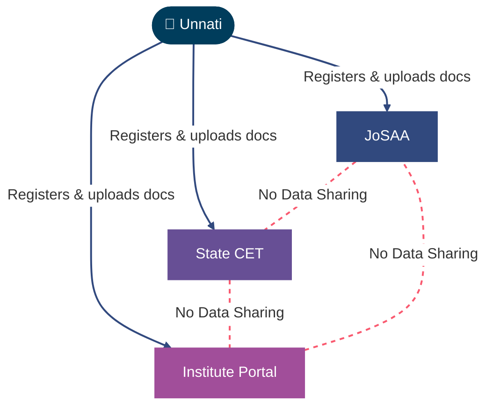
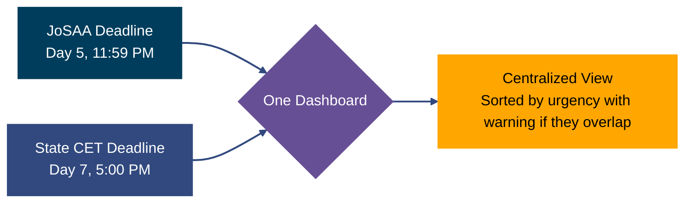

Unnati now understands the counseling process. She knows how JoSAA works, why documents are re-verified, and how terms like freeze, float, and slide change across portals. She also realizes India already has the shared infrastructure to back this up: DigiLocker holds her marksheets, APAAR replaces multiple exam numbers with a single academic ID, and DPDP protects her data privacy.

So here's the obvious question: if all of that already exists, why is she still typing her date of birth into a fourth website?

---

## The One Thing Every Problem Has in Common

Go back through everything and one thing is true across all of it: no system currently knows what another system already has.

JoSAA doesn't know that her state counselling board already has her category certificate. Her state board doesn't know JoSAA already verified her marksheet. Each system was built to run on its own, so each one asks her for everything, from scratch, every time.

Notice what's missing from that diagram. There's no line between JoSAA and the state CET. There never was. The only thing connecting all three systems right now is Unnati herself, carrying information from one to the other by hand.

## ..

## One Profile

Right now, Unnati types her name, date of birth, category, and rank into a JoSAA form. Then she types the exact same information into her state CET's form. If she registers for a third system, she types it a third time.

With Superadmission, she does this once. She verifies her identity through Aadhaar, the same way she'd log into any government service, and that one verified profile is what every counselling system actually reads from.

<CardGroup cols={2}>
  <Card title="Today" icon="repeat">
    New account, new form, same details typed in again, for every single counselling system she's eligible for.
  </Card>

  <Card title="With Superadmission" icon="user-check">
    One Aadhaar-verified profile. Created once. Read by every counselling system she connects it to.
  </Card>
</CardGroup>

This is exactly what the <Tooltip tip="Automated Permanent Academic Account Registry, a single academic ID meant to follow a student through school and every degree after it">APAAR</Tooltip> ID s built for. Instead of Superadmission inventing yet another student ID, it's designed to anchor Unnati's profile to the one she may already have.

## One Document Vault

The same pattern repeats with documents. Right now, her Class 12 marksheet gets uploaded to JoSAA, then uploaded again to her state CET, and each portal checks it independently, with its own file size limit and its own idea of what a valid scan looks like.

With Superadmission, a document gets fetched once from <Tooltip tip="India's government-run digital document locker, where boards and universities place signed, verified copies of certificates directly">DigiLocker</Tooltip>, or uploaded once if it isn't available there, and verified once. After that, every counselling system she's connected to can see that it's verified, without checking it themselves from scratch.

<CardGroup cols={2}>
  <Card title="Today" icon="upload">
    Same photo of the same marksheet, uploaded separately to every portal, verified independently, every time.
  </Card>

  <Card title="With Superadmission" icon="folder-check">
    Fetched once from DigiLocker where possible. Verified once. Reused everywhere she's registered.
  </Card>
</CardGroup>

<Note>
  Not every document lives on DigiLocker yet. Category certificates and domicile proofs, for instance, still vary by state. Where a document isn't available digitally, Unnati uploads it manually, once, and it's verified and reused from there the same way.
</Note>

## One Dashboard Instead Four Tabs Open at Once

This is the part that causes the most actual damage. JoSAA's acceptance window and her state CET's acceptance window can fall within hours of each other, and right now, there is nowhere she can see both at once. She finds out by checking two different websites and doing the math herself.

With Superadmission, both deadlines sit on one screen. If two windows are about to overlap, she's told in advance, not left to notice it herself. If she accepts a seat in one system, the platform tells her exactly what that means for the seat she's currently holding in the other.

## PraveshAI: The Part That Actually Advises Her

Everything above just removes repeated work. This part does something different: it gives her the kind of advice she'd otherwise have to pay a consultant for.

When Unnati is filling her preference list, PraveshAI looks at her rank, her category, and last year's closing ranks for each option, and tells her roughly how likely she is to get in. Not a guarantee, a probability, based on real numbers, shown next to each choice as she adds it.

It doesn't choose for her. It doesn't lock anything on her behalf. It just makes sure she isn't filling out a nine-stage form with less information than someone who paid ten thousand rupees for the same advice.

<Info>
  How PraveshAI actually calculates this, what it can and can't decide on its own, and how every recommendation stays traceable back to real data, is covered in its own section.
</Info>

## Journey, Before and After

Here's the same journey, run twice.

```mermaid
flowchart LR
    subgraph today["TODAY — The Current Journey"]
        direction LR
        T1(["Register on JoSAA<br/>Type everything in"]) --> T2(["Register on State CET<br/>Type it all in again"])
        T2 --> T3(["Upload docs to both<br/>Verified separately"])
        T3 --> T4(["Track two deadlines<br/>Check two sites manually"])
        T4 --> T5(["Get two allotments<br/>Compare them manually"])
        T5 --> T6(["Accept one<br/>Remember to withdraw the other"])
    end

    subgraph proposed["WITH SUPERADMISSION — Unified Journey"]
        direction LR
        P1(["Create one profile<br/>Enter data once"]) --> P2(["Connect to JoSAA + State CET<br/>Synced automatically"])
        P2 --> P3(["Documents fetched<br/>Verified once"])
        P3 --> P4(["Both deadlines<br/>One dashboard"])
        P4 --> P5(["Both allotments<br/>Side by side"])
        P5 --> P6(["Accept one<br/>Guided withdrawal from the other"])
    end

    today ~~~ proposed

    T1 -. saves duplicate entry .-> P1
    T2 -. saves duplicate entry .-> P2
    T3 -. saves duplicate upload .-> P3
    T4 -. saves duplicate tracking .-> P4
    T5 -. saves manual comparison .-> P5
    T6 -. removes the risk .-> P6

    classDef stage1 fill:#003d5c,stroke:#003d5c,color:#fff
    classDef stage2 fill:#31497e,stroke:#31497e,color:#fff
    classDef stage3 fill:#674f95,stroke:#674f95,color:#fff
    classDef stage4 fill:#a14e9a,stroke:#a14e9a,color:#fff
    classDef stage5 fill:#d44c8d,stroke:#d44c8d,color:#fff
    classDef stage6 fill:#f9596f,stroke:#f9596f,color:#fff

    class T1,P1 stage1
    class T2,P2 stage2
    class T3,P3 stage3
    class T4,P4 stage4
    class T5,P5 stage5
    class T6,P6 stage6

    style today fill:#0a1929,stroke:#ff7a47,stroke-width:2px,color:#fff
    style proposed fill:#1a1029,stroke:#ffa600,stroke-width:2px,color:#fff
```

---

So that's what changes for Unnati. But she's one student out of millions doing this at the same time. The next question is what all of this looks like from the other side, from the counselling authority that has to process thousands of students like her at once, without losing the control it's legally required to keep.
