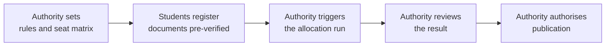

Every page so far has been from Unnati's side of the screen. But she's one of lakhs of students going through this at the same time, and someone on the other end has to actually process all of it, verify her documents, run the allotment, and eventually let her in the door.

---

## The Journey from Counselling Authority Perspective

Right now, a counselling authority's biggest time cost during a round usually isn't deciding who gets which seat. That part is genuinely mechanical, ranks in, seats out, following rules the authority already set. The time goes into everything around that decision: verifying documents that another system may have already checked, chasing students who've stalled halfway through a step, and answering grievances that often trace back to unclear communication rather than an actual wrong outcome.

With Superadmission, a student who arrives has already had their documents fetched from DigiLocker and verified once. The verification queue an authority's staff actually has to look at shrinks down to the harder cases, the ones that couldn't be auto-checked, and each of those already comes flagged with exactly what looks off, instead of a reviewer starting from a blank page on every single document.

<Note>
  The authority sets the rules. The authority reviews the result. The authority decides when it publishes. Superadmission runs the process the authority already owns, it doesn't take over the decision.
</Note>

**Here is what actually changes for them day-to-day:**

- **Less manual work:** They have far fewer documents to verify from scratch.
- **Fewer disputes:** Student errors drop because the system removes the confusion that usually causes them.
- **Real-time updates:** They get a live view of how a counseling round is progressing.

## The Journey from Institutions Perspective

By the time a student reaches an institution, the counselling process is mostly over, they just need to confirm the seat and let the student in. But institutions currently absorb a surprising amount of work that has nothing to do with actually admitting anyone.

Based on how admissions offices currently spend their time during a cycle, roughly 88% of it goes toward things that exist only because incoming student records are incomplete or unverified, chasing a missing document, correcting a data entry error, resolving a mismatch found only when the student shows up in person. Only about 12% goes toward anything resembling actual evaluation.

With Superadmission, an institution's involvement narrows down to two moments:

<Steps>
  <Step title="A confirmed allotment arrives automatically">
    The moment a student's payment clears, the institution receives a complete record: which programme, which category seat, which round, and every relevant document already marked verified. Nothing needs to be requested separately.
  </Step>
  <Step title="A QR code gets scanned on reporting day">
    The student shows up with a single-use, time-limited code. Scanning it checks three things instantly, payment received, allotment valid,  and either confirms the reporting or flags it for a look.
  </Step>
</Steps>
